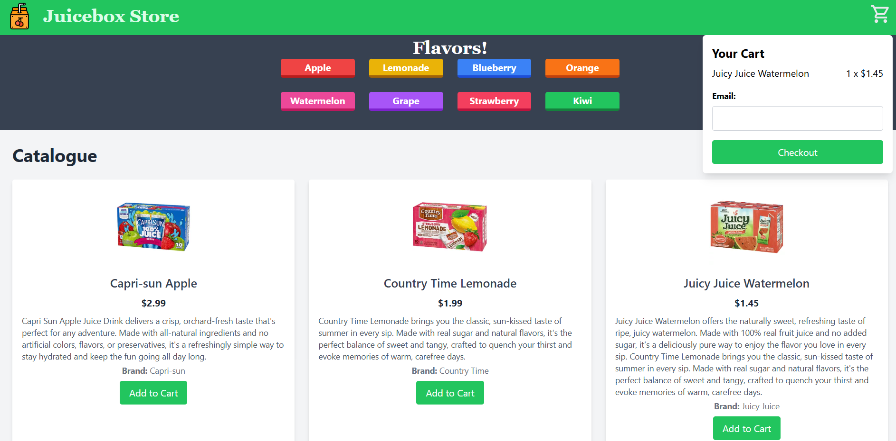

# Juicebox Store 🧃🍎

Juicebox Store is a fully functional e-commerce web application for juice lovers! This project allows users to explore a wide range of juice products, filter them by flavors, add them to a cart, and complete purchases with email confirmations.

## Features 🚀

- **Dynamic Product Filtering**: Filter products by selected flavors.
- **Add to Cart**: Add products to the cart with seamless updates.
- **Responsive Design**: Optimized for desktop and mobile devices.
- **Email Confirmation**: Sends a detailed email of purchased products.
- **Modern UI**: Built with React and TailwindCSS.

## Tech Stack 🛠️

- **Frontend**: React, TailwindCSS
- **Backend**: Node.js, Express.js
- **Database**: MongoDB
- **Email Service**: EmailJS

## Project Structure 📁
```bash
JuiceboxStore/
├── backend/
│   ├── server.js           # Node.js server
│   ├── routes/             # API routes
│   ├── models/             # MongoDB schemas
│   └── .env                # Environment variables
├── frontend/
│   ├── src/
│   │   ├── components/     # React components (NavBar, Catalogue, etc.)
│   │   └── App.js          # Main App component
│   ├── public/             # Static files (images, icons)
│   └── package.json        # Frontend dependencies
└── README.md               # Project documentation
```
## Setup and Installation ⚙️

### Prerequisites

- Node.js (v16+)
- MongoDB Atlas (or local MongoDB instance)
- EmailJS account
- Knowledge of setting up MongoDB connection

### Setup

1. Clone the repository:
   ```bash
   git clone https://github.com/yourusername/juicebox-store.git
   cd juicebox-store/backend
   ```
2. npm install in both front end and backend
3. Create ENV in backend with your own DB in MongoDb using this Schema
```bash
   _id: string;
  name: string;
  flavor: string[]; # Environment variables Note that an Item can only have two flavors and it must be from the ones listed in the Categories 
  description: string;
  price: number;
  brand: string;
  picture: string; #There are existing images in the public folder inside front-end in where you can do imagename.png or add your own images for whatever Item you would like to add
```
5. do ```cd front-end ```in one terminal than do ```npm run dev```
6. do ``` cd back-end ``` in another terminal then do ```node server.js```

### How to Use 🛍️
   
1. Select your favorite juice flavors from the Flavors section up to two flavors.
2. Browse the filtered products in the catalogue.
3. Add items to your cart.
4. Checkout by entering your email to receive a detailed purchase summary.

### ScreenShots


